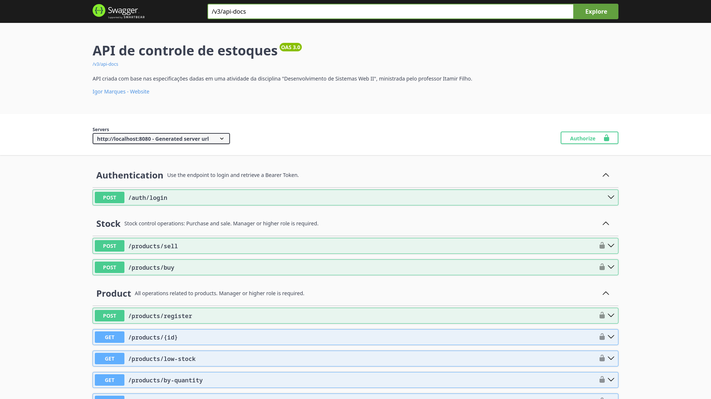
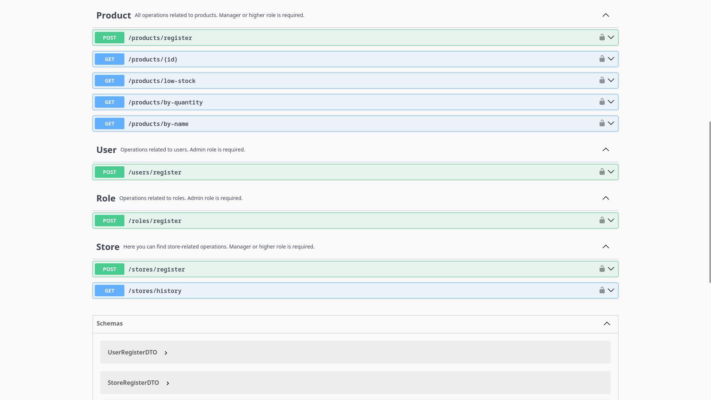

# Sistema de Controle de Estoque

Este projeto é um sistema de controle de estoque desenvolvido com Spring Boot, que permite o gerenciamento de produtos, usuários, papéis, lojas e operações de estoque, com um robusto sistema de controle de permissões.


## Tecnologias Utilizadas

- Spring Boot
- Banco de dados: H2 (para desenvolvimento) / PostgreSQL (para produção)
- Docker e Docker Compose
- Segurança: Spring Security com JWT
- Documentação: Swagger e OpenAPI 3


### Imagens da API




## Como rodar a aplicação
Por simplicidade, aqui vão as orientações para rodar o projeto com Docker Compose. Garanta que tenha Docker instalado na sua máquina
e também o JDK 21.

1. Após clonar o projeto e ir até o seu diretório raiz, execute o seguinte comando no terminal:

    ```bash
      ./gradlew build
     ``` 

    Um erro deve ocorrer, porém será criada uma pasta build/libs contendo um jar da aplicação. É o que precisamos.

2. Crie um arquivo .env na raiz do projeto. Nele, devem estar definidas 3 variáveis de ambiente:
    ```
   SECURITY_CONFIG_KEY= ***INSIRA UMA CHAVE AQUI***
   DB_USER=estoque
   DB_PASSWORD=estoque
    ```
   
    Para gerar uma chave válida basta executar o comando a seguir e substituir o resultado no seu arquivo .env:
   ```bash
        openssl rand -base64 32
    ```

3. Após isso, é hora de iniciar os containers do Docker Compose, faça isso com o seguinte comando:

    ```bash
        docker-compose up -d
   ```
   
Prontinho! Se tudo estiver ok, basta acessar `localhost:8080/swagger-ui.html` para ter acesso à documentação e começar a testar a API.

### Orientações para testagem

Por padrão a aplicação cria 3 roles ao iniciar a aplicação: ADMIN, MANAGER e USER;
Também são cadastrado 3 usuários, um para cada role:
- Username: admin, Password: admin
- Username: manager, Password: manager
- Username: user, Password: user

Use-os no endpoint de login para testar a geração do token!